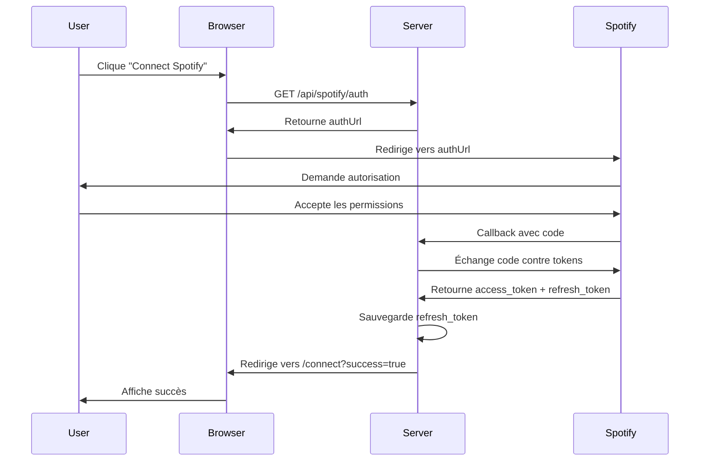

# 🔌 API OAuth 2.0 - Documentation Technique

## Endpoints OAuth

### 1. Générer l'URL d'Autorisation

**GET** `/api/spotify/auth`

Génère l'URL d'autorisation Spotify avec les scopes requis.

#### Request
```http
GET /api/spotify/auth HTTP/1.1
Host: localhost:3000
```

#### Response
```json
{
  "authUrl": "https://accounts.spotify.com/authorize?client_id=xxx&response_type=code&redirect_uri=http%3A%2F%2Flocalhost%3A3000%2Fapi%2Fspotify%2Fcallback&scope=user-library-read+user-follow-read+user-read-recently-played+playlist-read-private&state=xyz"
}
```

#### Scopes Demandés
- `user-library-read` - Lire les morceaux likés
- `user-follow-read` - Lire les artistes suivis
- `user-read-recently-played` - Historique d'écoute
- `playlist-read-private` - Accéder aux playlists privées

---

### 2. Callback OAuth

**GET** `/api/spotify/callback`

Endpoint appelé par Spotify après autorisation de l'utilisateur.

#### Request
```http
GET /api/spotify/callback?code=AQD...xyz&state=abc123 HTTP/1.1
Host: localhost:3000
```

#### Query Parameters
- `code` (string) - Code d'autorisation temporaire de Spotify
- `state` (string) - Token de sécurité CSRF (optionnel)
- `error` (string) - Message d'erreur si l'utilisateur refuse

#### Success Response
```
HTTP/1.1 302 Found
Location: /?spotify_connected=true
```

#### Error Response
```
HTTP/1.1 302 Found
Location: /?error=access_denied
```

#### Workflow Interne
1. Récupère le `code` depuis les query params
2. Échange le code contre des tokens via Spotify API
3. Sauvegarde le `refresh_token` dans `data/config.json`
4. Redirige vers `/connect` avec un indicateur de succès

---

### 3. Vérifier le Statut de Connexion

**GET** `/api/spotify/status`

Vérifie si Spotify est connecté et configuré.

#### Request
```http
GET /api/spotify/status HTTP/1.1
Host: localhost:3000
```

#### Response
```json
{
  "connected": true,
  "hasClientId": true,
  "hasClientSecret": true,
  "hasRefreshToken": true
}
```

#### Status Codes
- `200 OK` - Statut récupéré avec succès
- `500 Internal Server Error` - Erreur serveur

---

### 4. Déconnecter Spotify

**POST** `/api/spotify/disconnect`

Supprime le refresh token pour déconnecter Spotify.

#### Request
```http
POST /api/spotify/disconnect HTTP/1.1
Host: localhost:3000
Content-Length: 0
```

#### Response
```json
{
  "message": "Spotify disconnected successfully"
}
```

#### Status Codes
- `200 OK` - Déconnexion réussie
- `500 Internal Server Error` - Erreur lors de la déconnexion

---

## Flux OAuth 2.0 Complet

### Authorization Code Flow



---

## Gestion des Tokens

### Access Token

- **Durée de vie** : 1 heure
- **Stockage** : Mémoire (non persisté)
- **Refresh** : Automatique via refresh token

```typescript
// Exemple de refresh automatique
private async getUserAccessToken(): Promise<string> {
  // Vérifie si le token est encore valide
  if (this.accessToken && Date.now() < this.tokenExpiry) {
    return this.accessToken;
  }

  // Sinon, rafraîchit avec le refresh token
  const response = await fetch('https://accounts.spotify.com/api/token', {
    method: 'POST',
    headers: {
      'Authorization': `Basic ${Buffer.from(
        `${clientId}:${clientSecret}`
      ).toString('base64')}`,
      'Content-Type': 'application/x-www-form-urlencoded'
    },
    body: new URLSearchParams({
      grant_type: 'refresh_token',
      refresh_token: config.spotify.refreshToken
    }).toString()
  });

  const data = await response.json();
  this.accessToken = data.access_token;
  this.tokenExpiry = Date.now() + (data.expires_in * 1000) - 60000;

  return this.accessToken;
}
```

### Refresh Token

- **Durée de vie** : Indéfinie (jusqu'à révocation)
- **Stockage** : `data/config.json`
- **Usage** : Obtenir de nouveaux access tokens

---

## Utilisation de l'API Spotify

### Récupérer les Morceaux Likés

**GET** `/api/spotify/liked`

#### Request
```http
GET /api/spotify/liked?limit=50 HTTP/1.1
Host: localhost:3000
```

#### Query Parameters
- `limit` (number, optionnel) - Nombre de tracks à retourner (défaut: 50)

#### Response
```json
{
  "tracks": [
    {
      "id": "6rqhFgbbKwnb9MLmUQDhG6",
      "name": "Track Name",
      "artists": [
        { "name": "Artist Name" }
      ],
      "uri": "spotify:track:6rqhFgbbKwnb9MLmUQDhG6",
      "addedAt": "2023-01-15T10:30:00Z"
    }
  ]
}
```

---

## Exemples d'Intégration

### Frontend (JavaScript)

#### Initier la Connexion
```javascript
async function connectSpotify() {
  try {
    // Récupère l'URL d'autorisation
    const res = await fetch('/api/spotify/auth');
    const data = await res.json();
    
    // Redirige vers Spotify
    window.location.href = data.authUrl;
  } catch (error) {
    console.error('Erreur:', error);
  }
}
```

#### Vérifier le Statut
```javascript
async function checkSpotifyStatus() {
  const res = await fetch('/api/spotify/status');
  const data = await res.json();
  
  if (data.connected) {
    console.log('✅ Spotify est connecté');
  } else {
    console.log('❌ Spotify n\'est pas connecté');
  }
}
```

#### Déconnecter
```javascript
async function disconnectSpotify() {
  if (!confirm('Déconnecter Spotify ?')) return;
  
  const res = await fetch('/api/spotify/disconnect', {
    method: 'POST'
  });
  
  const data = await res.json();
  console.log(data.message);
  
  // Recharger le statut
  await checkSpotifyStatus();
}
```

### Backend (Node.js/TypeScript)

#### Service Spotify

```typescript
import { SpotifyService } from './services/SpotifyService';

const spotifyService = new SpotifyService();

// Vérifier si configuré
if (spotifyService.isConfigured()) {
  // Récupérer les morceaux likés
  const tracks = await spotifyService.getLikedTracks(50);
  console.log(`${tracks.length} morceaux likés trouvés`);
}
```

---

## Sécurité

### Protection CSRF

Le paramètre `state` est utilisé pour prévenir les attaques CSRF :

```typescript
getAuthorizationUrl(state?: string): string {
  const params = new URLSearchParams({
    // ...
    state: state || Math.random().toString(36).substring(7)
  });
  // ...
}
```

### Stockage Sécurisé

- ✅ Client Secret : Jamais exposé au frontend
- ✅ Refresh Token : Stocké côté serveur uniquement
- ✅ Access Token : En mémoire, jamais persisté

### HTTPS en Production

En production, utilisez HTTPS pour toutes les communications :

```bash
SPOTIFY_REDIRECT_URI=https://votre-domaine.com/api/spotify/callback
```

---

## Gestion des Erreurs

### Erreurs Courantes

#### `invalid_client`
```json
{
  "error": "invalid_client",
  "error_description": "Invalid client credentials"
}
```
**Solution** : Vérifiez Client ID et Client Secret

#### `invalid_grant`
```json
{
  "error": "invalid_grant",
  "error_description": "Invalid authorization code"
}
```
**Solution** : Le code d'autorisation a expiré (10 min), refaites le flow

#### `redirect_uri_mismatch`
```json
{
  "error": "redirect_uri_mismatch"
}
```
**Solution** : Vérifiez que la Redirect URI dans Spotify Dashboard correspond exactement

### Logging

Tous les événements OAuth sont loggés :

```typescript
logger.info('Spotify authorization URL generated');
logger.info('Successfully exchanged Spotify authorization code for tokens');
logger.error('Failed to get Spotify user access token', { error: error.message });
```

Consultez `logs/app.log` pour le debugging.

---

## Tests

### Test Manuel

1. Démarrez le serveur : `npm start`
2. Testez chaque endpoint :

```bash
# 1. Générer l'URL d'auth
curl http://localhost:3000/api/spotify/auth

# 2. Ouvrir l'URL dans le navigateur et autoriser

# 3. Vérifier le statut
curl http://localhost:3000/api/spotify/status

# 4. Récupérer les morceaux likés
curl http://localhost:3000/api/spotify/liked

# 5. Déconnecter
curl -X POST http://localhost:3000/api/spotify/disconnect
```

### Test Automatisé (à implémenter)

```typescript
describe('Spotify OAuth', () => {
  it('should generate authorization URL', async () => {
    const res = await request(app).get('/api/spotify/auth');
    expect(res.status).toBe(200);
    expect(res.body.authUrl).toContain('accounts.spotify.com');
  });

  it('should check connection status', async () => {
    const res = await request(app).get('/api/spotify/status');
    expect(res.status).toBe(200);
    expect(res.body).toHaveProperty('connected');
  });
});
```

---

## Limitations

- **Rate Limiting** : Spotify limite à ~180 requêtes/minute
- **Token Expiration** : Access tokens expirent après 1h
- **Scope Changes** : Modifier les scopes requiert une nouvelle autorisation

---

## Références

- [Spotify Authorization Guide](https://developer.spotify.com/documentation/web-api/concepts/authorization)
- [OAuth 2.0 RFC 6749](https://datatracker.ietf.org/doc/html/rfc6749)
- [Spotify Web API Reference](https://developer.spotify.com/documentation/web-api)

---

**Version** : 1.0.0  
**Dernière mise à jour** : Novembre 2025
